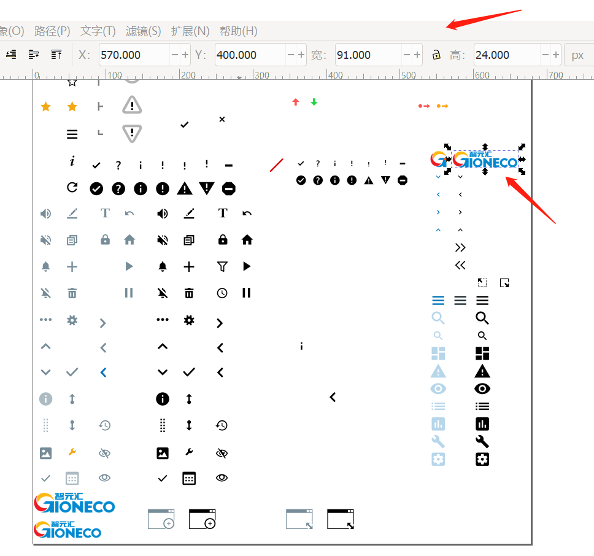
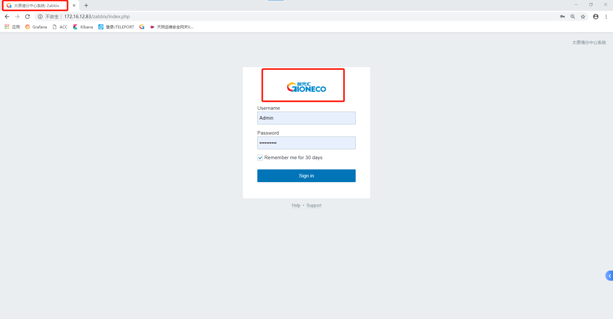

# zabbix web页面自定义


## 页面title修改


* 查找配置文件

  ```shell
  find / -name  zabbix.conf.php
  ```

* 修改配置

  ```shell
  vim zabbix.conf.php
  ###修改如下变量
  $ZBX_SERVER_NAME = "在此填写自己需要修改内容，可以是中文"
  ```

* 刷新页面即可

## 页面logo修改


* 查找配置文件

  ```shell
  find / -name icon-sprite.svg
  ###默认路径assets/img/icon-sprite.svg
  ```

* 使用工具编辑svg文件

  1、删除zabbix图标

  2、导入logo
  
  3、将导入的logo图片调整到原先位置（详细的坐标及大小如下截图）
  
  
  
  
  
  
* 替换icon-sprite.svg文件

  目前已经编辑好部分版本的icon-sprite.svg文件直接替换即可

## 页面title图标替换

* 查找ico文件

  ```shell
  find / -name favicon.ico
  ###默认路径web根目录favicon.ico
  ```

* 替换ico图标

  已经准备好了图标直接替换即可

## 结果预览

