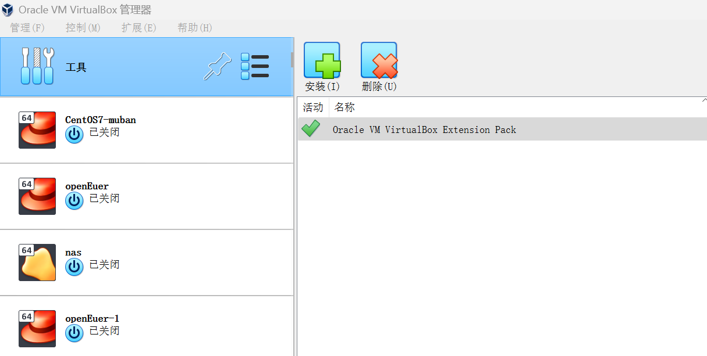
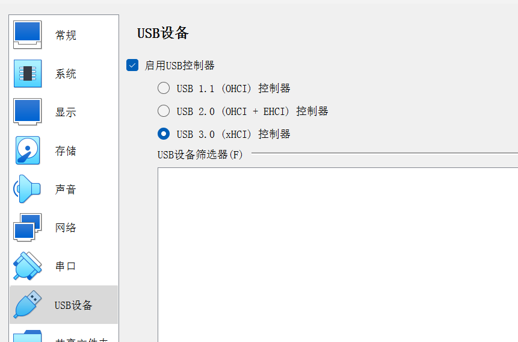

# KVM虚拟化

## 安装

```shell
#qemu-kvm： 主要是KVM用户态的管理工具，来帮助我们管理KVM
#libvirt: 虚拟化管理工具，当libvirtd进程终止后，正在运行的虚拟机不受影响。
#virt-install: 安装虚拟机的工具，调用libvirt的API来进行管理。
#启动之后会有一个类似virbr0的网卡
yum install -y qemu-kvm  libvirt virt-install virt-viewer libguestfs-tools
systemctl start libvirtd
```


## 常用命令

```shell
#查看所有主机
virsh list --all
#启动虚拟机
virsh start win10
#查看虚拟机基本信息
virsh dominfo win10
#查看虚拟机VNC
virsh vncdisplay win10
#关闭虚拟机
virsh shutdown win10
#强制关闭虚拟机
virsh destroy win10
#重启虚拟机
virsh reboot win10
#恢复虚拟机
virsh resume win10
#删除虚拟机
virsh undefine win10
rm -f /var/lib/libvirtd/win10.img
#克隆虚拟机
virt-clone --auto-clone -o moban -n hadoop-code-1
virt-clone -f /opt/kvmdata/GPDB-1.qcow2  -o moban -n GPDB-1
#CPU和内存动态扩容
virsh edit win10
#创建一个raw格式，容量为10G的虚拟磁盘：
qemu-img create -f raw /opt/CentOS-7.raw 10G	
#创建一个qcow2格式，容量为10G的虚拟磁盘：
qemu-img create -f qcow2 /opt/CentOS-7.qcow2 10G
#扩展磁盘
qemu-img resize /opt/CentOS-7.qcow2 +2G
#在本地的tmp目录下上传一个CentOS7的安装镜像，使用此镜像来安装虚拟机
#安装虚拟机,指定磁盘位置
virt-install --virt-type kvm --name CentOS-7 --ram 2048 --vcpus=2 \
--cdrom=/tmp/CentOS-7.2-x86_64-DVD-1511.iso --disk path=/opt/CentOS-7-x86_64.raw \
--network bridge=virbr1 --graphics vnc,listen=0.0.0.0 --noautoconsole
#提示：	
#也可以使用一次性指定磁盘大小的方式，磁盘文件会根据数据量的大小变化而变化；
#如遇到iso权限问题需要将镜像移动至/tmp目录即可；
#安装虚拟机,指定磁盘大小-s指定虚拟磁盘大小为20G
virt-install  --virt-type kvm --name CS7-1c2g20g  --ram 2048  --vcpus=2 -s 20 \
--cdrom=/tmp/CentOS-7.2-x86_64-DVD-1511.iso --hvm  --os-type=linux -f /vm/1c2g20g.img \
--graphics vnc,listen=0.0.0.0 --noautoconsole
	
#输入命令之后，显示已经在开始安装，此时，可以通过vnc远程连接到宿主机上，使用默认的端口，查看到系统安装界面：
netstat -lntup|grep kvm
	tcp        0      0 0.0.0.0:5900            0.0.0.0:*               LISTEN      19516/qemukvm
#修改虚拟机密码(需要停止虚拟机）
virt-customize -a /data/moban1.qcow2 --root-password password:Zonecd@2019
```


# Docker

## 常用命令

### 基础命令

```shell
#拉取一个镜像
docker pull images_name
#导出镜像
docker save -o image_name.tar image_name
#删除镜像
docker rmi image_name
#启动一个容器
docker run hello-world
docker run -it --name=con_name images
docker run --name=con_name -p 10001:8080 images
```


### 清理空间

```shell
#删除所有已经停止的容器
#注意：要先确认停止的容器中是否有不可以删除的，也可以删除后使用镜像再启一个容器。
docker rm $(docker ps -a|grep Exited |awk '{print $1}')
docker rm $(docker ps -qf status=exited)
```

```shell
#删除所有未打标签的镜像
docker rmi $(docker images -q -f dangling=true)
#删除所有不再使用的镜像
docker image prune -a
```


## 网络代理

### Dockerd 代理

在执行`docker pull`时，是由守护进程`dockerd`来执行。因此，代理需要配在`dockerd`的环境中。而这个环境，则是受`systemd`所管控，因此实际是`systemd`的配置。

```shell
sudo mkdir -p /etc/systemd/system/docker.service.d
sudo touch /etc/systemd/system/docker.service.d/proxy.conf
```

在这个`proxy.conf`文件（可以是任意`*.conf`的形式）中，添加以下内容：

```shell
##http代理
[Service]
Environment="HTTP_PROXY=http://proxy.example.com:8080"
Environment="HTTPS_PROXY=http://proxy.example.com:8080"
Environment="NO_PROXY=localhost,127.0.0.1,.example.com"
```

```shell
##socks5代理
[Service]
Environment="HTTP_PROXY=socks5://proxy.example.com:8080"
Environment="HTTPS_PROXY=socks5://proxy.example.com:8080"
Environment="NO_PROXY=localhost,127.0.0.1,.example.com"
```

其中，`proxy.example.com:8080` 要换成可用的免密代理。通常使用 `cntlm` 在本机自建免密代理，去对接公司的代理。可参考《Linux下安装配置Cntlm 代理》。

### Container 代理

在容器运行阶段，如果需要代理上网，则需要配置 `~/.docker/config.json`。以下配置，只在Docker 17.07及以上版本生效。

```shell
{
 "proxies":
 {
   "default":
   {
     "httpProxy": "http://proxy.example.com:8080",
     "httpsProxy": "http://proxy.example.com:8080",
     "noProxy": "localhost,127.0.0.1,.example.com"
   }
 }
}
```

这个是用户级的配置，除了 `proxies`，`docker login` 等相关信息也会在其中。而且还可以配置信息展示的格式、插件参数等。

此外，容器的网络代理，也可以直接在其运行时通过 `-e` 注入 `http_proxy` 等环境变量。这两种方法分别适合不同场景。`config.json` 非常方便，默认在所有配置修改后启动的容器生效，适合个人开发环境。在CI/CD的自动构建环境、或者实际上线运行的环境中，这种方法就不太合适，用 `-e` 注入这种显式配置会更好，减轻对构建、部署环境的依赖。当然，在这些环境中，最好用良好的设计避免配置代理上网。

### **Docker Build 代理**

虽然 `docker build` 的本质，也是启动一个容器，但是环境会略有不同，用户级配置无效。在构建时，需要注入 `http_proxy` 等参数。

```shell
docker build . \
    --build-arg "HTTP_PROXY=http://proxy.example.com:8080/" \
    --build-arg "HTTPS_PROXY=http://proxy.example.com:8080/" \
    --build-arg "NO_PROXY=localhost,127.0.0.1,.example.com" \
    -t your/image:tag
```

**注意**：无论是 `docker run` 还是 `docker build`，默认是网络隔绝的。如果代理使用的是 `localhost:3128` 这类，则会无效。这类仅限本地的代理，必须加上 `--network host` 才能正常使用。而一般则需要配置代理的外部IP，而且代理本身要开启 Gateway 模式。

###  **重启生效**

代理配置完成后，`reboot` 重启当然可以生效，但不重启也行。

`docker build` 代理是在执行前设置的，所以修改后，下次执行立即生效。Container 代理的修改也是立即生效的，但是只针对以后启动的 Container，对已经启动的 Container 无效。

`dockerd` 代理的修改比较特殊，它实际上是改 `systemd` 的配置，因此需要重载 `systemd` 并重启 `dockerd` 才能生效。

```shell
sudo systemctl daemon-reload
sudo systemctl restart docker
```

## 构建

### 软件源错误

```shell
#Q debian系列构建镜像报错日志
W: GPG error: http://mirrors.tuna.tsinghua.edu.cn/debian buster InRelease: At least one invalid signature was encountered.
E: The repository 'http://mirrors.tuna.tsinghua.edu.cn/debian buster InRelease' is not signed.
#A 清理docker数据（可能是多次构建导致数据异常，软件源没有问题）
docker image prune -a 
docker container prune -a
docker system prune
docker system df
```

## 跨主机通信

### macvlan实现

```shell
#需要linux内核支持3.9+,两台机器设置使用桥接模式,网卡混杂模式开启全部允许
docker network create --driver macvlan --subnet=192.168.0.0/24 --gateway=192.168.0.254 -o parent=eth0 macvlan_1

#1. -o parent=eth0  绑定到eth0网卡上(对外的网卡)
#2. macvlan_1为自定义的该通道的名字
#3. 创建完成后docker network ls就能看到创建的这个网络了
#4. 以上创建macvlan的命令在两台主机上都要执行
# 分别在两台主机上执行以下命令
docker run -it --network macvlan_1 --ip=192.168.0.10 centos:centos7 /bin/bash 
docker run -it --network macvlan_1 --ip=192.168.0.20 centos:centos7 /bin/bash 
```


# Kubernetes

## 网络插件

### Calico

#### 容器网络限速

```shell
#更改calico的配置
kubectl edit cm calico-config -n kube-system
#在plugins中添加如下内容：
{ 
  "type": "bandwidth",
  "capabilities": {"bandwidth": true}
}

#完成配置

# Please edit the object below. Lines beginning with a '#' will be ignored,
# and an empty file will abort the edit. If an error occurs while saving this file will be
# reopened with the relevant failures.
#
apiVersion: v1
data:
  calico_backend: bird
  cni_network_config: |-
    {
      "name": "k8s-pod-network",
      "cniVersion": "0.3.1",
      "plugins": [
        {
          "type": "calico",
          "log_level": "info",
          "log_file_path": "/var/log/calico/cni/cni.log",
          "etcd_endpoints": "__ETCD_ENDPOINTS__",
          "etcd_key_file": "__ETCD_KEY_FILE__",
          "etcd_cert_file": "__ETCD_CERT_FILE__",
          "etcd_ca_cert_file": "__ETCD_CA_CERT_FILE__",
          "mtu": __CNI_MTU__,
          "ipam": {
              "type": "calico-ipam"
          },
          "policy": {
              "type": "k8s"
          },
          "kubernetes": {
              "kubeconfig": "__KUBECONFIG_FILEPATH__"
          }
        },
        {
          "type": "portmap",
          "snat": true,
          "capabilities": {"portMappings": true}
        },
        {
          "type": "bandwidth",
          "capabilities": {"bandwidth": true}
        }
      ]
    }
  etcd_ca: /calico-secrets/etcd-ca
  etcd_cert: /calico-secrets/etcd-cert
  etcd_endpoints: https://172.26.67.11:2379,https://172.26.67.12:2379,https://172.26.67.13:2379
  etcd_key: /calico-secrets/etcd-key
  typha_service_name: none
  veth_mtu: "1440"
kind: ConfigMap
metadata:
  name: calico-config
  namespace: kube-system
  
###重启一下calico-node
kubectl delete pod -n kube-system -l k8s-app=calico-node

###创建pod
apiVersion: v1
kind: Pod
metadata:
  name: nginx
  annotations:
    kubernetes.io/ingress-bandwidth: 20M
    kubernetes.io/egress-bandwidth: 20M
spec:
  containers:
  - name: nginx
    image: nginx:1.17.10
    
#然后在Pod所在的节点上，执行以下命令，查看是否有qdisc规则
tc qdisc show 
qdisc tbf 1: dev calic440f455693 root refcnt 2 rate 20Mbit burst 256Mb lat 25.0ms 
qdisc ingress ffff: dev calic440f455693 parent ffff:fff1 ---------------- 
qdisc tbf 1: dev 79c7 root refcnt 2 rate 20Mbit burst 256Mb lat 25.0ms
```


## 亲和性

> **nodeAffinity**节点亲和性
>
> **podAffinity**亲和性
>
> **podAntiAffinity**反亲和性
>
> requiredDuringSchedulingIgnoredDuringExecution 强制满足
>
> preferredDuringSchedulingIgnoredDuringExecution 非强制满足

### 节点亲和性

```yaml
affinity:
  nodeAffinity:
    requiredDuringSchedulingIgnoredDuringExecution:
      nodeSelectorTerms:    #在nodeAffinity下面，如果是required，则需要使用nodeSelectorTerms   #多个nodeSelectorTerms是或的关系，满足一个即可
      - matchExpressions:   #多个matchExpressions是与的关系，全部满足才会调度
        - key: "kubernetes.io/hostname"   # 一个matchExpressions里的多个key也是与的关系
          operator: In
          values:
          - k8s-node1
          - k8s-node2

    preferredDuringSchedulingIgnoredDuringExecution:
    - weight: 100           #weight是必须的，不论是nodeAffinity还是podAffinity    
      preference:           #preference只在nodeAffinity的preferred条件里使用,也可以配置多个
        matchExpressions:
        - key: "kubernetes.io/hostname"
          operator: In
          values:
          - k8s-node3
```

### POD亲和性

```yaml
affinity:
  podAffinity:
    requiredDuringSchedulingIgnoredDuringExecution:
    - labelSelector: #如果是在podAntiAffinity下的required，则必须使用labelSelector
        matchExpressions: #关于pod的matchExpressions是多个条件必须同时满足才会调度
        - key: security
          operator: In    #operator：配置和节点亲和力一致，但是没有Gt和Lt
          values:
          - S1
      topologyKey: "kubernetes.io/hostname"

    preferredDuringSchedulingIgnoredDuringExecution:
    - weight: 100
      podAffinityTerm:       #如果是pod的preferred，则需要使用podAffinityTerm，下面再跟labelSelector，这个是必须要有的
        labelSelector:
          matchExpressions:
          - key: security
            operator: In
            values:
            - S2
        topologyKey: "kubernetes.io/hostname"   #对于pod的affinity或antiaffinity，topologykey是必须有的，
```

### POD反亲和性

```yaml
affinity:
  podAntiAffinity:
    requiredDuringSchedulingIgnoredDuringExecution:
      - labelSelector:
          matchExpressions:
          - key: app
            operator: In
            values:
            - web-store
        topologyKey: "kubernetes.io/hostname"
    preferredDuringSchedulingIgnoredDuringExecution:
    - weight: 100
      podAffinityTerm:
        labelSelector:
          matchExpressions:
          - key: security
            operator: In
            values:
            - S2
        topologyKey: "kubernetes.io/hostname"
```

# VirtualBox

## 问题处理

### 7.0.20 版本安装路径

> 新版本只能安装到C盘，需要创建好安装的目录，使用CMD执行以下命令。

```cmd
icacls "D:\VirtualBox" /reset /t /c
icacls "D:\VirtualBox" /inheritance:d /t /c
icacls "D:\VirtualBox" /grant *S-1-5-32-545:(OI)(CI)(RX)
icacls "D:\VirtualBox" /deny *S-1-5-32-545:(DE,WD,AD,WEA,WA)
icacls "D:\VirtualBox" /grant *S-1-5-11:(OI)(CI)(RX)
icacls "D:\VirtualBox" /deny *S-1-5-11:(DE,WD,AD,WEA,WA)
```

### 鼠标不会动

> 需要安装/Oracle_VM_VirtualBox_Extension_Pack扩展包






### MAC安装

> 需要进入软件根目录，执行以下命令才能正常引导，注意替换虚拟机名称。

```cmd
VBoxManage.exe modifyvm "Mac-10.14" --cpuidset 00000001 000106e5 00100800 0098e3fd bfebfbff
VBoxManage setextradata "Mac-10.14" "VBoxInternal/Devices/efi/0/Config/DmiSystemProduct" "iMAC11,3"
VBoxManage setextradata "Mac-10.14" "VBoxInternal/Devices/efi/0/Config/DmiSystemVersion" "1.0"
VBoxManage setextradata "Mac-10.14" "VBoxInternal/Devices/efi/0/Config/DmiBoardProduct" "Iloveapple"
VBoxManage setextradata "Mac-10.14" "VBoxInternal/Devices/smc/0/Config/DeviceKey" "ourhardworkbythesewordsguardedpleasedontsteal(c)AppleComputerInc"
VBoxManage setextradata "Mac-10.14" "VBoxInternal/Devices/smc/0/Config/GetKeyFromRealSMC" 1
```

